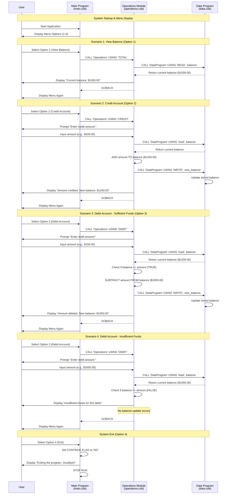

# COBOL Account Management System Documentation

## Overview

This repository contains a legacy COBOL-based account management system designed for student account operations. The system provides basic banking functionality including balance inquiries, credit transactions, and debit transactions with built-in business rules for account management.

## Architecture

The system follows a modular design with three main COBOL programs that work together:

```text
MainProgram (main.cob)
    ↓
Operations (operations.cob)
    ↓
DataProgram (data.cob)
```

## File Descriptions

### 1. main.cob - Main Program Module

**Purpose**: Entry point and user interface controller for the account management system.

**Key Functions**:

- Displays the main menu interface
- Handles user input and menu navigation
- Controls program flow and session management
- Delegates operations to the Operations module

**Business Logic**:

- Provides a simple text-based menu system with options 1-4
- Implements input validation for menu choices
- Manages the main program loop until user exits
- Acts as the controller in the system architecture

**Menu Options**:

1. View Balance - Displays current account balance
2. Credit Account - Adds funds to the account
3. Debit Account - Withdraws funds from the account
4. Exit - Terminates the program

### 2. operations.cob - Business Operations Module

**Purpose**: Handles core business logic for account transactions and balance operations.

**Key Functions**:

- **Balance Inquiry (`TOTAL`)**: Retrieves and displays current account balance
- **Credit Transaction (`CREDIT`)**: Processes deposits/credits to student accounts
- **Debit Transaction (`DEBIT`)**: Processes withdrawals/debits from student accounts

**Business Rules**:

#### Credit Operations

- Accepts any positive amount for credits
- Automatically updates account balance
- Displays confirmation with new balance
- No upper limit restrictions on credit amounts

#### Debit Operations

- **Insufficient Funds Protection**: Prevents overdrafts by checking available balance before processing
- Only processes debits if `CURRENT_BALANCE >= DEBIT_AMOUNT`
- Displays "Insufficient funds" message for rejected transactions
- Updates balance only for successful transactions
- Provides transaction confirmation with new balance

#### Data Handling

- Communicates with DataProgram for persistent storage operations
- Uses standardized operation codes: 'READ' and 'WRITE'
- Maintains transaction integrity through proper data flow

### 3. data.cob - Data Management Module

**Purpose**: Handles data persistence and storage operations for account balances.

**Key Functions**:

- **Data Retrieval (`READ`)**: Fetches current balance from storage
- **Data Storage (`WRITE`)**: Persists updated balance to storage
- Maintains account balance state between operations

**Business Rules**:

- **Default Balance**: Initializes student accounts with $1,000.00
- **Data Integrity**: Ensures consistent balance storage and retrieval
- **Single Account Model**: Currently supports one account per session
- **Decimal Precision**: Maintains currency precision to 2 decimal places (9(6)V99 format)

**Storage Specifications**:

- Balance format: Up to $999,999.99 maximum
- Persistent storage within program session
- Thread-safe operations through COBOL linkage conventions

## Student Account Business Rules Summary

### Account Initialization

- **Starting Balance**: All student accounts begin with $1,000.00
- **Currency Format**: All amounts use standard currency format with 2 decimal places

### Transaction Rules

1. **Credits**: No restrictions on credit amounts (accepts any positive value)
2. **Debits**: Subject to insufficient funds checking
3. **Balance Protection**: System prevents negative balances
4. **Transaction Confirmation**: All successful operations display updated balance

### System Limitations

- **Single Session**: Data persistence limited to program execution session
- **Single Account**: System handles one account at a time
- **No User Authentication**: No login or account identification required
- **Manual Input**: All transaction amounts require manual user entry

## Technical Specifications

### Data Types

- **Balance Storage**: `PIC 9(6)V99` - Supports up to $999,999.99
- **Operation Codes**: `PIC X(6)` - 6-character operation identifiers
- **User Input**: `PIC 9` for menu choices, `PIC 9(6)V99` for amounts

### Program Flow

1. Main program displays menu and accepts user choice
2. Operations module processes business logic based on choice
3. Data module handles read/write operations for balance persistence
4. Results displayed to user with updated balance information

### Error Handling

- **Invalid Menu Choices**: Displays error message and returns to menu
- **Insufficient Funds**: Prevents transaction and displays warning
- **Input Validation**: Basic validation for numeric menu choices

## Future Enhancement Opportunities

When modernizing this legacy system, consider:

- Multi-user account support with unique identifiers
- Persistent database storage (currently in-memory only)
- Enhanced error handling and logging
- Transaction history and audit trails
- Additional account types and business rules
- Web-based or GUI interface
- Authentication and security features
- Currency validation and formatting improvements

## System Data Flow Diagram

The following sequence diagram illustrates the data flow and interactions between the three COBOL modules for different operations:



### Key Data Flow Patterns

1. **Menu-Driven Architecture**: All user interactions start with the main menu
2. **Modular Operation Calls**: Main program delegates specific operations to the Operations module
3. **Centralized Data Management**: All balance read/write operations go through DataProgram
4. **Transaction Safety**: Balance is read before any modification and written only after successful validation
5. **User Feedback Loop**: Every operation provides immediate feedback before returning to the menu
6. **Error Prevention**: Insufficient funds checking prevents invalid transactions from proceeding
